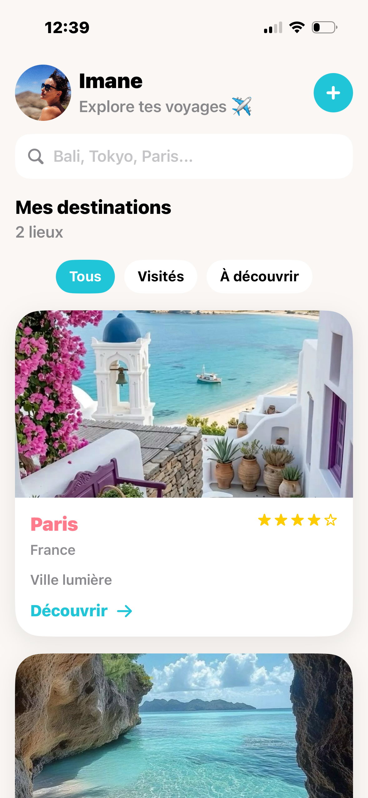
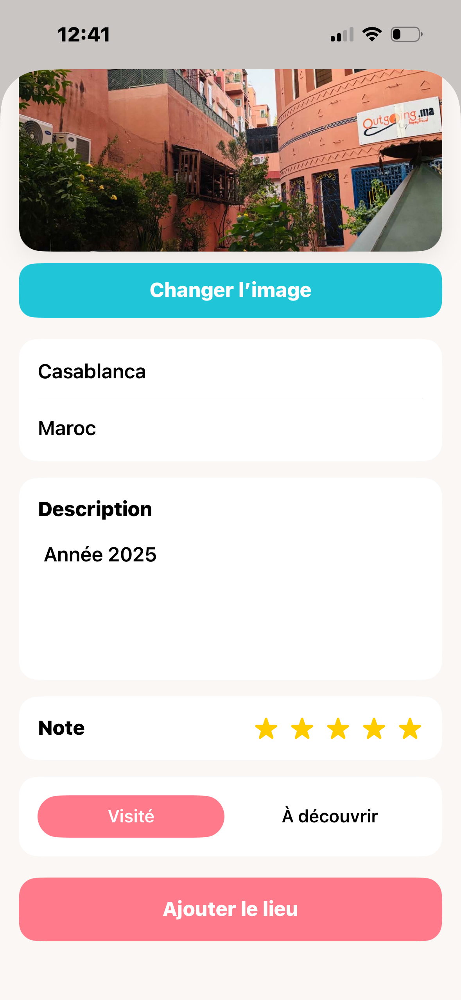

# 🌍 Carnet de Voyage iOS

Application iOS développée en SwiftUI lors de ma formation Conceptrice Développeuse d'Application iOS permettant d’organiser et de suivre ses voyages à travers le monde.

# Fonctionnalités principales

- Ajout de destinations (ville, pays, statut)
- Recherche de lieux par ville ou pays
- Filtrage des voyages :
  - Tous
  - Visités
  - À découvrir
- Affichage des détails d’un lieu
- Intégration de MapKit (localisation sur carte)
- Ajout de nouveaux voyages via formulaire
- Navigation fluide avec NavigationStack
- Interface moderne et responsive en SwiftUI

# Aperçu de l’application

## Profil

  

### Ajout

  

### Détail

  

# Technologies utilisées

- Swift
- SwiftUI
- NavigationStack
- @State / @Binding
- Architecture MV (Views / Models / Mock data)

# Structure du projet

- `ProfilView` → écran principal (liste des voyages, recherche, filtres)
- `DetailCardView` → détail d’un lieu
- `AjoutCardView` → formulaire d’ajout
- `ModifierCardView` → formulaire de modification
- `Models/`
  - `User`
  - `Lieu`
- Données mock pour les tests

# Améliorations possibles

- Persistance des données (SwiftData / CoreData)
- Ajout de photos pour chaque destination
- Authentification utilisateur
- Mode sombre amélioré
- Notifications de voyages

# Développeuse

**Imane Boujnane**  
Projet lors de ma formation de Conceptrice Développeuse d'application iOS à Simplon.co – apprentissage SwiftUI

# Objectif du projet

Ce projet a pour objectif de renforcer mes compétences en développement iOS, notamment sur SwiftUI, la gestion d’état et la navigation, tout en construisant une application complète et évolutive.

# Note

Ce projet est en constante évolution et sert de base pour mes futurs projets iOS plus avancés.
